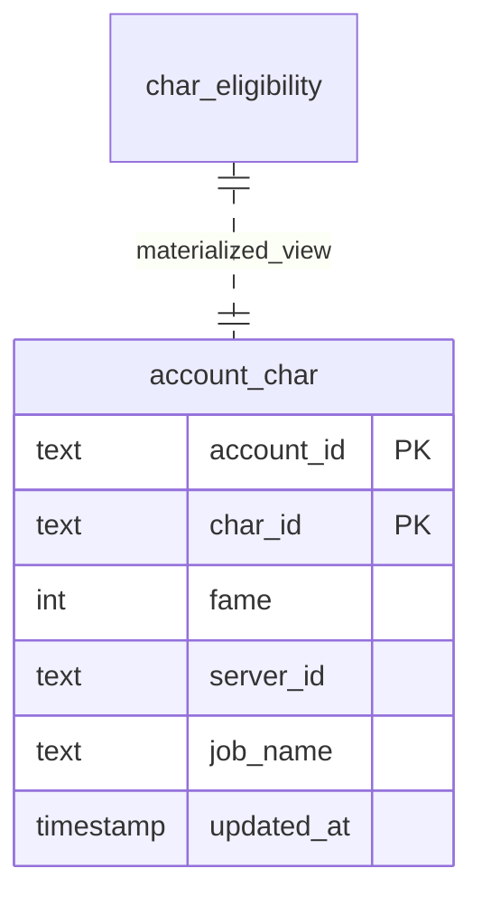

# 던파 캐릭터 분류·컨텐츠 추천 **PRD v0.9**

> **Stack**
>
> * Frontend: **SvelteKit + daisyUI(Tailwind 3)**
> * Backend: **Express (Node 20)** – 단일 REST 서버
> * Scheduler: **node-cron** (GitHub Actions는 백업)
> * DB: **PostgreSQL / Supabase**
> * Infra: Docker Compose → Render․com or Fly.io (dev) → AWS Fargate (prod)

> **Out-of-scope** (별도 문서) – TDD 시나리오, 상세 API 스펙, ADR, 배포 YAML

---

## 0. 문서 메타

| 항목     | 값                              |
| ------ | ------------------------------ |
| 작성일    | 2025-06-15                     |
| 버전     | 0.9 (Draft for team review)    |
| 작성자    | Lim Yoobin                     |
| 검토 예정자 | FE Tech Lead, BE Tech Lead, PM |

---

## 1. 배경 & 문제 정의

1. **수작업 Pain Point** – 매주 길드원 캐릭터를 엑셀에 복사 → 명성 필터 → 컨텐츠 가용 여부를 직접 눈으로 계산.
2. **정보 갱신 지연** – 명성 변동(강화·계승·이벤트) 반영이 느려 파티 구성에 오류.
3. **복잡한 컨텐츠 슬롯** – 컨텐츠마다 *명성 조건 + 계정당 최대 입장 수* 규칙이 달라 실시간 계산이 필요.

---

## 2. 목표 & KPI (MVP 스코프)

| 목표             | KPI                  | 범위                |
| -------------- | -------------------- | ----------------- |
| **자동 데이터 수집**  | Manual 입력 시간 0 분     | 주 1 회 크론 완료       |
| **컨텐츠 추천 정확도** | 잘못 분류 < 1 %          | 명성 ±1 위 오차 포함     |
| **프론트 조회 속도**  | 계정 20개(캐릭 240) < 1 초 | SSG + SWR 캐싱      |
| **운영 단순화**     | 배포 스크립트 1 클릭         | Docker image push |

---

## 3. 핵심 용어

| 용어            | 정의                                                |
| ------------- | ------------------------------------------------- |
| **Account**   | Neople API `accountId` 기준 하나의 게임 계정               |
| **Character** | `characterId` 단위 전투 캐릭터                           |
| **Fame**      | 모험가 명성 (`adventureFame`)                          |
| **Slot**      | 컨텐츠별 계정당 허용 캐릭터 수 (예: 흉몽 4)                       |
| **Tier**      | Fame 범위를 구간화한 내부 태그 (Legend/Epic/Rare/Unranked 등) |

---

## 4. 사용자 페르소나 & 시나리오

| 페르소나                     | 기대 행동                                                 |
| ------------------------ | ----------------------------------------------------- |
| **Raid Captain** (길드 리더) | 금요일 18시, 대시보드에서 “나벨 입장 가능 캐릭” 정렬 → 파티 편성 → Discord 공지 |
| **Casual Player**        | 월요일 22시, 본인 계정 요약 → “이번 주 흉몽 가능 캐릭 3/4” 확인 후 우선 순위 결정 |
| **Operator**             | 목요일 01시, 데이터 크론 실패 알림 Slack 확인 → 재실행 버튼 클릭            |

---

## 5. 범위 정의

### In-Scope (MVP)

1. **캐릭터 데이터 주간 수집** (명성·직업·서버)
2. **컨텐츠별 입장 가능 캐릭터 계산** (나벨, 흉몽, 여신전, 애쥬어, 베누스)
3. **대시보드 UI** – 계정 아코디언 + 컨텐츠 탭 + 슬롯 뱃지
4. **운영 콘솔** – 수동 Sync, 로그 조회
5. **Discord Webhook 알림** – 주간 변동 리포트 (옵션 P1)

### Out-of-Scope (후순위)

* 실시간(일 1회 초과) Sync
* 캐릭터 장비·버프 통계
* 파티 자동 매칭 알고리즘

---

## 6. 기능 요구사항 (Epic → Story → Task)

### **Epic E-1. 데이터 수집 & 저장**

| Story ID  | Story (P\*)             | Tasks                                                                                           |
| --------- | ----------------------- | ----------------------------------------------------------------------------------------------- |
| **S-1.1** | “주간 Fame 스캔 스케줄링” (P0)  | 1) node-cron 설정 (월 04:00 KST)  2) Fame 구간 루프(40 k \~ 62 k, 폭 ≤ 10 k)  3) 호출당 200 rows 페이징 |
| **S-1.2** | “캐릭터 ↔ Account 매핑” (P0) | 1) `/characters/:id` 상세 API  2) accountId 로 그룹핑  3) `account_char` table UPSERT           |
| **S-1.3** | “Sync 오류 리트라이” (P1)     | 1) Axios Retry + 지수적 백오프  2) 실패 row 로그 → `sync_fail` 테이블                                     |

### **Epic E-2. Eligibility 연산**

| Story                                 | Tasks                                                                          |
| ------------------------------------- | ------------------------------------------------------------------------------ |
| **S-2.1 “컨텐츠 Fame 룰 엔진”** (P0)        | 1) 룰 JSON 구성 2) Fame ≥ Rule → Boolean 필드 계산                                 |
| **S-2.2 “계정별 슬롯 필터”** (P0)            | 1) `row_number() over(partition by account)` SQL 2) 흉몽 Top 4, 베누스 Top 1 자르기 |
| **S-2.3 “Materialized View 반영”** (P1) | 1) `char_eligibility` 뷰 생성 2) Sync 이후 `REFRESH`                             |

### **Epic E-3. API & Backend 서비스**

| Story                                                   | Tasks                                                                        |
| ------------------------------------------------------- | ---------------------------------------------------------------------------- |
| **S-3.1 “REST endpoint /accounts/\:id/eligibles”** (P0) | 1) Express Router 설정  2) SQL Join → JSON 응답  3) Cache-Control (10 min) |
| **S-3.2 “Admin Console routes”** (P1)                   | `/sync/run`, `/sync/logs`                                                    |

### **Epic E-4. 프론트 UI/UX (SvelteKit + daisyUI)**

| Story                          | Tasks                                                                               |
| ------------------------------ | ----------------------------------------------------------------------------------- |
| **S-4.1 “계정 대시보드 목록”** (P0)    | 1) `AccountSummary` store(SWR)  2) daisyUI `accordion` 컴포넌트  3) 최고 Fame badge |
| **S-4.2 “컨텐츠 탭 & 슬롯 뱃지”** (P0) | 1) `tab` 컴포넌트: Raid/Adv/Legion  2) `badge` 색상 ✓/✕  3) 슬롯 제한 회색 처리             |
| **S-4.3 “검색·필터 바”** (P2)       | 계정명/캐릭명/직업 필터 인풋                                                                    |

### **Epic E-5. DevOps & 모니터링**

| Story                             | Tasks                                                              |
| --------------------------------- | ------------------------------------------------------------------ |
| **S-5.1 “CI/CD 파이프라인”** (P0)      | 1) `docker compose build`  2) GitHub Actions push -> Fly deploy |
| **S-5.2 “Error & Slack 알림”** (P1) | 1) cron 실패 → Slack Webhook  2) 5xx rate > 1 % 경고                |

---

## 7. 비-기능 요구사항 (NFR)

| 카테고리       | 목표                                |
| ---------- | --------------------------------- |
| **성능**     | API 응답 < 300 ms (95 p)            |
| **보안**     | Neople API Key 서버-환경변수로만 보관       |
| **데이터 품질** | Sync 중복율 0 % (PRIMARY KEY UPSERT) |
| **가용성**    | MTTR < 30 분 / 주간 Sync 성공율 ≥ 99 %  |

---

## 8. 데이터 모델 (요약)

(자세한 컬럼·인덱스 정의 → “DB Schema.md” 별도)

---

## 9. UX 레퍼런스

* **Atomic UI** – daisyUI `card/accordion/badge/tab/progress`
* **모바일 대응** – 단일 컬럼, acc → 컨텐츠 탭 스크롤
* **Color Scheme** – Tier 별

  * Legend #FFD700
  * Epic #C957FF
  * Rare #00BFFF
  * Unranked #B0BEC5

---

## 10. 의존성·제약

1. **Neople API 쿼터** – 90 req/min, 60 rpm 추천
2. **DB 호스팅** – Supabase Free tier (500 MB) ⇒ 데이터 retention 14 일
3. **daisyUI** – Tailwind 3 필수, JIT 모드 요구

---

## 11. 리스크 & 대응

| 리스크        | 영향         | 대응                              |
| ---------- | ---------- | ------------------------------- |
| API 스키마 변경 | Sync 실패    | API 버전 체크, 변동 감지 테스트            |
| Fame 룰 변경  | 잘못된 추천     | 룰 JSON Config + Admin 패널 수정     |
| 호출 한도 초과   | 대시보드 갱신 지연 | 크론 간 rate limiter, 실패 row 재시도 큐 |

---

## 12. 마일스톤 (예시)

| 주차  | 목표                         |
| --- | -------------------------- |
| W 1 | DB 스키마·Express 기본 서버       |
| W 2 | node-cron Sync + UPSERT 완료 |
| W 3 | Eligibility 연산 로직 & API    |
| W 4 | SvelteKit 대시보드 MVP 공개      |
| W 5 | Discord 알림·슬롯 회색 처리        |
| W 6 | Beta 테스팅 & 성능 튜닝           |

---

## 13. QA & 측정

* **단위 테스트** (Jest) – 룰 엔진, Slot 필터
* **E2E** (Playwright) – 계정 대시보드 렌더·필터
* **Metrics** – Prometheus exporter: sync\_duration, api\_latency

---

## 14. 열린 이슈 / 결정 로그

| 날짜    | 내용                      | 상태       |
| ----- | ----------------------- | -------- |
| 06-15 | 나벨 Fame 완화폭 −1 000 고정?  | 논의 중     |
| 06-15 | Supabase vs PlanetScale | POC 후 결정 |

---

### 다음 단계

1. 팀 리뷰 반영 → **v1.0 PRD** 확정
2. “DB Schema.md”, “API Spec.yaml”, “Test Plan.md” 개별 초안 작성
3. 마일스톤 W1 착수 (DB 모델링)

필요한 추가·수정 사항 알려주시면 바로 반영하겠습니다!
